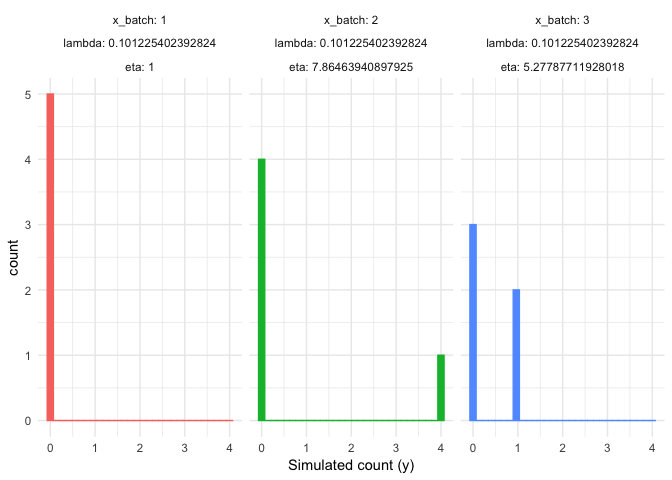
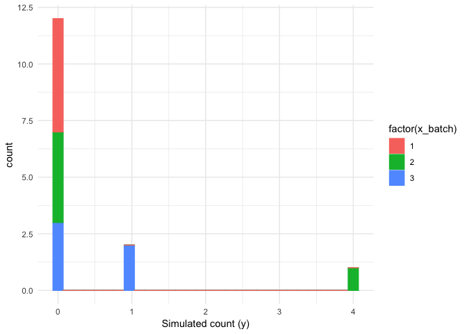
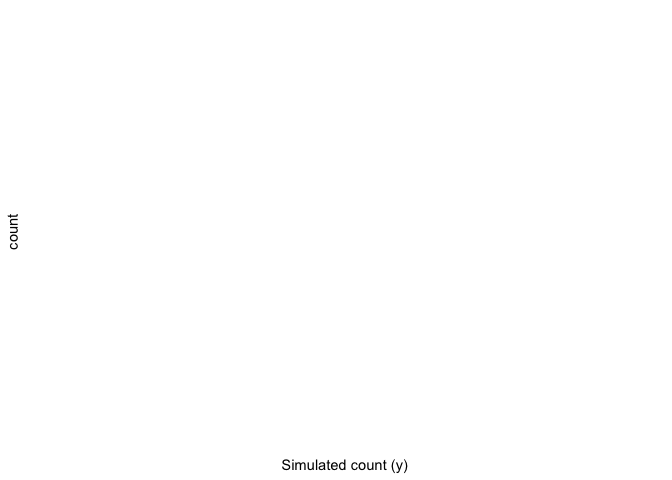
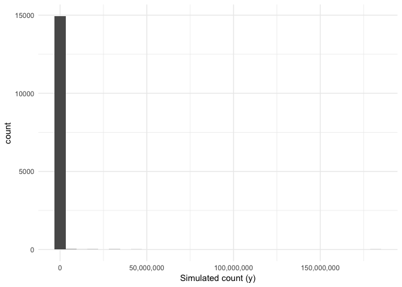
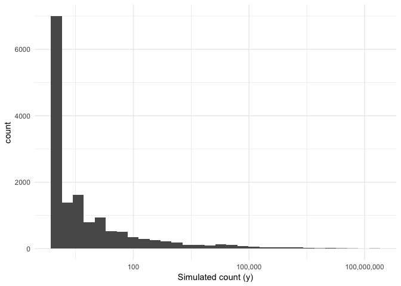
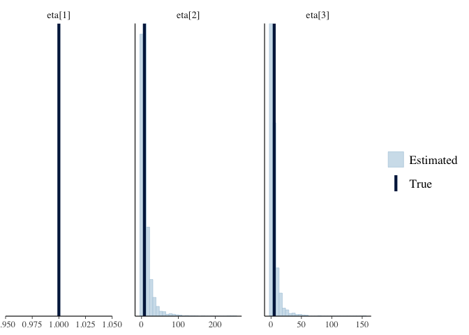
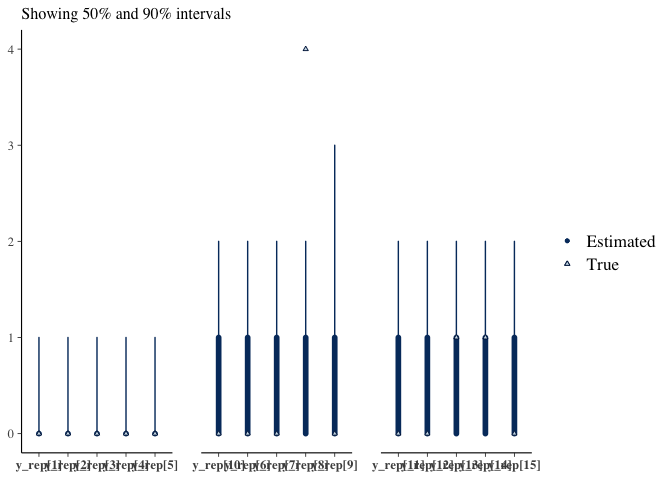

Review class IIa models
================
Jacqueline Buros
12/3/2018

In this document we will review the **random intercept (RI) model** presented in the Bioarxiv paper by Silverman et al [Naught all zeros in count data are the same](https://www.biorxiv.org/content/early/2018/11/26/477794).

This model is classified as a "class IIa model" (Patial Technical Bias Model) in the above manuscript. By their description, these are models that *account for technical bias as seen in a partial technical process.*

> For example, consider a situation where DNA from a specified transcript is amplified with different efficiency between batches (e.g. PCR bias differs between batches).

In this document, as in the paper, we will consider a scenario in which frequencies of a **single transcript** are quantified across batches & samples.

The model
---------

The observed counts *y*<sub>*i*</sub> are distributed according to a Poisson with a rate parameter depends on the sample *z*<sub>*i*</sub> and the batch *x*<sub>*i*</sub>:

*y*<sub>*i*</sub> ∼ Poisson(*λ*<sub>*z*<sub>*i*</sub></sub>*η*<sub>*x*<sub>*i*</sub></sub>)

where *η*<sub>*m*</sub> is defined per batch (considered a 'multiplicative bias'):

*η*<sub>*m*</sub> ∼ LogNormal(*ν*, *ω*<sup>2</sup>); *η*<sub>1</sub> = 1

and *λ*<sub>*k*</sub> is defined per sample (and represents a sample-specific rate):

*λ*<sub>*k*</sub> ∼ LogNormal(*μ*, *σ*<sup>2</sup>)

Finally the model includes a hyper-prior on the sample-specific rate *μ* representing a geometric mean abundance across our samples, excluding technical bias:

*μ* ∼ Normal(*ρ*, *τ*<sup>2</sup>)

It is notable in the above that the constraint on *η* such that *η*<sub>1</sub> = 1 reflects an assumption that the batch labelled "1" is the so-called unbiased sample. Your particular data may or may not contain a batch that is more reliable than the others.

The paper does not describe how one would generalize this model to several transcripts, although such a generalization is likely relevant to their discussion. In addition, it is likely that any estimate of differential expression would be modeled as a difference in *μ* per transcript according to experimental conditions (thus, representing the difference in expression in the absence of any technical bias), but this is also not specifically described by the authors in the methods.

Data simulation
===============

It can be helpful to see simulated data according to this process, in order to better understand the practical significance of each of the steps described above.

Importantly, this type of model assumes that **the zero values observed are due to sampling variance** (ie a zero value is more likely for a transcript with low abundance), but that the magnitude of this sampling variance differs according to technical bias within the batch.

The [simulation\_bayes.R](simulation/simulation_bayes.R) file in the paper's repository includes the following code for data simulation:

``` r
dat <- list()
# Universal priors
lambda_prior <- c(5, 3)
theta_prior <- c(.5, .5)
gamma_prior <- c(1, 1)

# Type IIa Zeroes
lambdas <- c(1.4, 0.6, 3.2)
batch <- rep(1:3, each=5)
counts <- c(0,1,2,3,1,0,1,0,2,0,8,1,2,0,5)
dat$type2a <- within(list(), {
  y <- counts
  x <- batch
  z <- rep(1, length(y))
  N <- length(y)
  N_person <- length(unique(z))
  N_batch <- length(unique(x))
  lambda_prior <- lambda_prior
  theta_prior <- theta_prior
  gamma_prior <- gamma_prior
})
str(dat$type2a)
```

    ## List of 9
    ##  $ gamma_prior : num [1:2] 1 1
    ##  $ theta_prior : num [1:2] 0.5 0.5
    ##  $ lambda_prior: num [1:2] 5 3
    ##  $ N_batch     : int 3
    ##  $ N_person    : int 1
    ##  $ N           : int 15
    ##  $ z           : num [1:15] 1 1 1 1 1 1 1 1 1 1 ...
    ##  $ x           : int [1:15] 1 1 1 1 1 2 2 2 2 2 ...
    ##  $ y           : num [1:15] 0 1 2 3 1 0 1 0 2 0 ...

Here the authors are simulating data for a single transcript with 3 batches and 5 technical replicates per batch.

We can also simulate these data according to the data-generating process described above. We will modify the names of some parameters for clarity. We will additionally borrow from the above in conjuction with the Stan code provided in ([m2a.stan](simulation/m2a.stan)) to derive hyper-prior values (*ρ* = −1; *τ* = 5; *σ* = 3; *ν* = 0; *ω* = 2)).

``` r
ours <- list()

# params
n_persons <- 1 # k
n_batches <- 3 # m
n_replicates <- 5
n_obs <- n_persons*n_batches*n_replicates

# hyper-priors
rho <- -1
tau <- 5
sigma <- 3
nu <- 0
omega <- 2

# simulation
mu <- rnorm(rho, tau, n = 1)
eta <- rlnorm(mu, sigma, n = n_batches)
lambda <- rlnorm(nu, omega, n = n_persons)
x <- rep(seq_len(n_batches), each = n_persons*n_replicates)  # batch identifier
z <- rep(seq_len(n_persons), times = n_batches*n_replicates) # person/sample identifier
y <- rpois(lambda[z]*eta[x], n = n_obs)
sim_data <- dplyr::tibble(x, z, y, 
                          lambda = lambda[z], 
                          eta = eta[x])
str(sim_data)
```

    ## Classes 'tbl_df', 'tbl' and 'data.frame':    15 obs. of  5 variables:
    ##  $ x     : int  1 1 1 1 1 2 2 2 2 2 ...
    ##  $ z     : int  1 1 1 1 1 1 1 1 1 1 ...
    ##  $ y     : int  0 0 0 0 0 490 455 469 455 430 ...
    ##  $ lambda: num  4.21 4.21 4.21 4.21 4.21 ...
    ##  $ eta   : num  0.00214 0.00214 0.00214 0.00214 0.00214 ...

With only 5 technical replicates, it is very difficult to evaluate whether the simulated data are reasonable. For example, if we repeat this process a few times we will get very different results each time.

*Aside: this process of simulating data using the priors in our model has a name -- we call these values [Prior predictive values](https://betanalpha.github.io/assets/case_studies/principled_bayesian_workflow.html#sec:prior-model) and their distribution is the "prior predictive distribution". Reviewing these values to see whether the resulting distribution is reasonable (before reviewing observed data) is a standard part of the bayesian analysis workflow.*

At any rate, in our case we want to use this data-generating process to better understand the assumptions of our model.

First, we will wrap the above in a function so that we can repeat it several times. (Note here that the default values are set according to those used by the paper).

``` r
sim_data_2a <- function(n_persons = 1, n_batches = 3, n_replicates = 5, rho = -1, tau = 5, sigma = 3, nu = 0, omega = 2) {
  n_obs <- n_persons*n_batches*n_replicates
  mu <- rnorm(rho, tau, n = 1)
  eta <- double(length = n_batches)
  eta[1] <- 1
  if (n_batches > 1)
    eta[2:n_batches] <- rlnorm(mu, sigma, n = n_batches-1)
  lambda <- rlnorm(nu, omega, n = n_persons)
  x <- rep(seq_len(n_batches), each = n_persons*n_replicates)  # batch identifier
  z <- rep(seq_len(n_persons), times = n_batches*n_replicates) # person/sample identifier
  y <- rpois(lambda[z]*eta[x], n = n_obs)
  sim_data <- dplyr::tibble(x_batch = x, z_sample = z, y, 
                            lambda = lambda[z], 
                            eta = eta[x])
  structure(sim_data,
            stan_data = list(y = y, z = z, x = x, 
                             lambda_prior = c(tau, sigma), 
                             eta_prior = c(nu, omega),
                             N = n_obs,
                             N_person = n_persons,
                             N_batch = n_batches),
            true_values = list(eta = eta,
                               mu = mu,
                               lambda = lambda))
}
```

Let's test this code to see what our simulated data look like:

``` r
sim_data <- sim_data_2a()
ggplot(sim_data, aes(x = y, fill = factor(x_batch), colour = factor(x_batch))) +
  geom_histogram(position = 'dodge') +
  facet_wrap( ~ x_batch + lambda + eta, labeller = label_both) +
  theme_minimal() + 
  theme(legend.position = 'None') +
  scale_x_continuous('Simulated count (y)')
```



The resulting counts are derived from 3 batches, each with the same value of *λ* and different values of *η*.

This should help to illustrate how the zero values are in part a reflection of the low-frequency of the transcript and in part a reflection of the technical "batch" effect.

Seen together (pooling effects across batches), we can see that the frequency of zero-valued counts is *both* a function of the relative abundance (based on `lambda`) and the technical bias (based on `eta`).

``` r
ggplot(sim_data, aes(x = y, fill = factor(x_batch), colour = factor(x_batch))) +
  geom_histogram(position = 'stack') +
  theme_minimal() + 
  scale_x_continuous('Simulated count (y)')
```



However, this is only a single instance of simulated data.

If we repeat it a second time, we can get very different distribution of values.

``` r
ggplot(sim_data_2a(), aes(x = y, fill = factor(x_batch), colour = factor(x_batch))) +
  geom_histogram(position = 'stack') +
  theme_minimal() + 
  scale_x_continuous('Simulated count (y)')
```



We can programmatically repeat this many times and plot the "overall" distribution of values.

``` r
sim_data_multibatch <- purrr::rerun(.n = 1000, sim_data_2a()) %>%
  dplyr::bind_rows(.id = 'iteration')
ggplot(sim_data_multibatch, aes(x = y)) +
  geom_histogram() +
  theme_minimal() + 
  theme(legend.position = 'None') +
  scale_x_continuous('Simulated count (y)', labels = scales::comma)
```



Notice that we have a high proportion of very low values and a few very (very) high values.

Let's plot this on a log-scale to get a better sense of the distribution of values.

``` r
ggplot(sim_data_multibatch, aes(x = y + 1)) +
  geom_histogram() +
  theme_minimal() + 
  theme(legend.position = 'None') +
  scale_x_log10('Simulated count (y)', labels = scales::comma)
```



This represents what our data would look like if we had say 1000 transcripts, each of which had a different *λ* and *η* drawn from the priors described above.

We can see that this model is capable of generating a high proportion of zero-valued counts, due in part to technical bias across batches and in part scaled by the relative transcript abundance. While the batch effect is capable of scaling our counts close to zero, it is also capable of scaling our counts up to very high observed frequencies.

While the resulting distribution may or may not look reasonable, it's important to keep in mind the assumptions that the model has made in the above. The degree to which these assumptions are reasonable (and the degree to which these priors are reasonable) will depend a lot on the type of data you are looking at.

Model fit to simulated data
---------------------------

Nonetheless, assuming we are happy with this model, we can continue with the analysis process and use Stan to try to recover the parameters from simulated data.

Here, we will use these data simulated earlier from our function & plotted above:

``` r
ggplot(sim_data, aes(x = y, fill = factor(x_batch), colour = factor(x_batch))) +
  geom_histogram(position = 'dodge') +
  facet_wrap( ~ x_batch + lambda + eta, labeller = label_both) +
  theme_minimal() + 
  theme(legend.position = 'None') +
  scale_x_continuous('Simulated count (y)')
```


Passing the simulated data to `rstan::stan` in order to sample from the posterior.

``` r
fit2a <- rstan::stan(file = 'stan/m2a.stan',
                     data = attr(sim_data, 'stan_data'))
```

``` r
print(fit2a, pars = 'y_rep', include = F)
```

    ## Inference for Stan model: m2a.
    ## 4 chains, each with iter=2000; warmup=1000; thin=1; 
    ## post-warmup draws per chain=1000, total post-warmup draws=4000.
    ## 
    ##               mean se_mean    sd   2.5%    25%    50%    75%  97.5% n_eff
    ## eta_id[1]    10.90    0.43 15.86   0.88   2.97   6.14  12.42  50.84  1380
    ## eta_id[2]     5.12    0.19  7.70   0.29   1.27   2.64   5.77  27.31  1697
    ## lambda[1]     0.15    0.00  0.14   0.01   0.05   0.10   0.20   0.53  1609
    ## lambda_mean  -1.98    0.06  2.70  -7.32  -3.84  -1.97  -0.09   3.24  1872
    ## eta[1]        1.00     NaN  0.00   1.00   1.00   1.00   1.00   1.00   NaN
    ## eta[2]       10.90    0.43 15.86   0.88   2.97   6.14  12.42  50.84  1380
    ## eta[3]        5.12    0.19  7.70   0.29   1.27   2.64   5.77  27.31  1697
    ## lp__        -12.01    0.04  1.47 -15.80 -12.71 -11.67 -10.94 -10.18  1589
    ##             Rhat
    ## eta_id[1]      1
    ## eta_id[2]      1
    ## lambda[1]      1
    ## lambda_mean    1
    ## eta[1]       NaN
    ## eta[2]         1
    ## eta[3]         1
    ## lp__           1
    ## 
    ## Samples were drawn using NUTS(diag_e) at Mon Dec  3 15:28:44 2018.
    ## For each parameter, n_eff is a crude measure of effective sample size,
    ## and Rhat is the potential scale reduction factor on split chains (at 
    ## convergence, Rhat=1).

Comparing the model-estimated values to those used to simulate our data, we can see that our model recovers parameter estimates quite well.

``` r
bayesplot::mcmc_recover_hist(x = as.array(fit2a, pars = c('eta')), true = attr(sim_data, 'true_values')$eta)
```



And, not surprisingly, one can "predict" (given the posterior estimates of parameters) the observed counts quite well per batch.

``` r
bayesplot::mcmc_recover_intervals(x = as.array(fit2a, pars = 'y_rep'),
                                  true = sim_data$y,
                                  batch = sim_data$x_batch,
                                  size = 1,
                                  facet_args = list(scales = 'free_x'))
```



Extending for differential expression analysis
----------------------------------------------

The question becomes, how would we use this model for a differential expression analysis? (and, related question of how they evaluated this model in the paper?)
